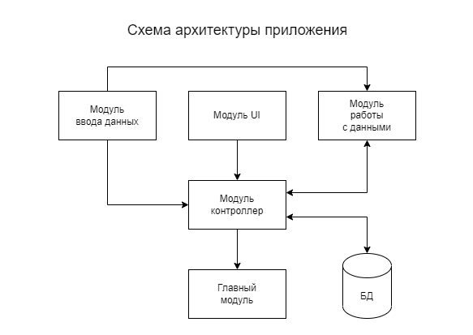

# Информационная система

## Задача

Создать информационную систему позволяющую работать с сотрудниками некой компании \ студентами вуза \ учениками школы. Обязательно наличие внешнего хранилища информации в виде или текстового файла или файла .json.
Обязательно приложить на гитхаб описание вашей системы - как работает ваша система, что делает, как устроена.

## Скриншоты

Скриншоты всех модулей находятся в папке *img*.

## Архитектура приложения

